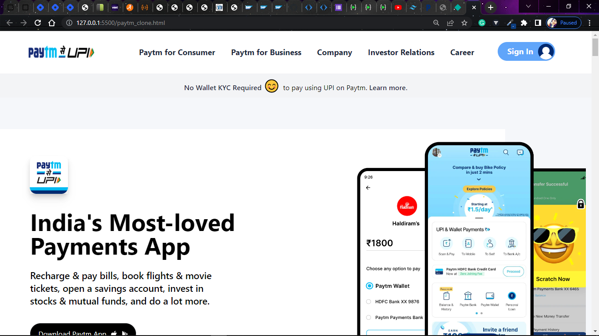

# 1st Tailwind Project
This one is a paytm clone which I've made using Tailwind CSS.

- From this Project, I've learned about:-
  - How to use Tailwind CSS in a real project.
  - One can easily start with Tailwind when already knowing CSS.
  - It's quite easy to use, we can directly inject the CSS into Html itself, No need to maintain a new file for CSS.
  - Tailwind contains the same properties that CSS contains.
  - It's quite difficult to make your website responsive only by using CSS, but using Tailwind, we can make responsive websites very quickly.

> ### The Screenshot of the site is attached below:-

### As this one was my first Tailwind project so the time I've taken is:-
> - 13 Hour 30 minutes

> ### The link to the site: [Paytm clone](https://aim-paytm-clone.netlify.app/)